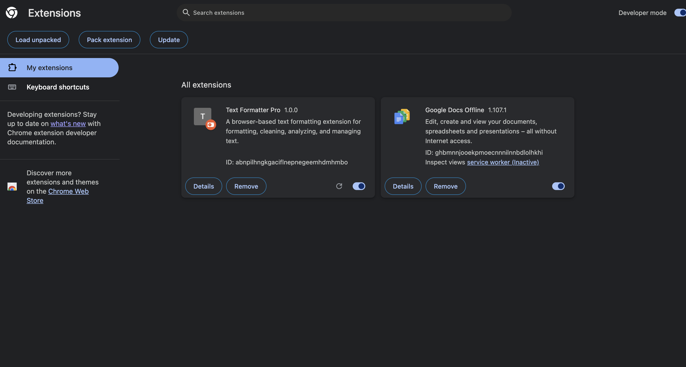

# Text Formatter Pro Installation Guide

This guide explains how to install, build, configure, and run Text Formatter Pro as a Chrome Extension.

## Table of Contents

- [Version](#version)
- [Overview](#overview)
- [System Requirements](#system-requirements)
- [Prerequisites](#prerequisites)
- [Clone Repository](#clone-repository)
- [Install Dependencies](#install-dependencies)
- [Run Development Server](#run-development-server)
- [Build Extension](#build-extension)
- [Enable Chrome Developer Mode](#enable-chrome-developer-mode)
- [Load Unpacked Extension](#load-unpacked-extension)
- [Pin Extension to Toolbar](#pin-extension-to-toolbar)
- [Verify Installation](#verify-installation)
- [Configure Initial Settings](#configure-initial-settings)
- [Reloading Extension After Code Changes](#reloading-extension-after-code-changes)
- [Uninstalling the Extension](#uninstalling-the-extension)
- [Installation Troubleshooting](#installation-troubleshooting)

## Version

**Application:** Text Formatter Pro  
**Version:** 1.0.0  
**Platform:** Chrome Extension  
**Manifest Version:** Manifest V3  

## Overview

Text Formatter Pro follows a modular React-based Chrome Extension architecture built to provide quick text formatting and cleanup utilities directly inside the browser.

This document covers installation steps for development, testing, and local extension setup.

## System Requirements

Required:

- Git version control
- Google Chrome or Chromium-based browser
- Node.js
- npm package manager

## Prerequisites

Verify Git installation:

```bash
git --version
```

Verify Node.js installation:

```bash
node --version
```

Verify npm installation:

```bash
npm --version
```

## Clone Repository

Clone the project repository:

```bash
git clone <repository-url>
```

Navigate into the project:

```bash
cd text-formatter-pro
```

## Install Dependencies

Install project dependencies:

```bash
npm install
```

This installs all required packages from `package.json`.

## Run Development Server

Start the local development environment:

```bash
npm run dev
```

This allows testing interface changes during development.

> Note:
> The development server is used for development only. Chrome Extension testing requires the production build.

## Build Extension

Create a production build:

```bash
npm run build
```

The build command generates a production-ready `dist` folder containing extension files.

## Enable Chrome Developer Mode

1. Open Google Chrome.

2. Navigate to:

```text
chrome://extensions/
```

3. Enable **Developer Mode** from the top-right corner.

Developer Mode allows manually loading local extensions.

## Load Unpacked Extension

1. Click:

```text
Load unpacked
```

2. Select the generated `dist` folder.

3. Confirm the extension appears in the Chrome Extensions list.

Text Formatter Pro is now installed.

## Pin Extension to Toolbar

To access quickly:

1. Click the Chrome extensions icon.
2. Locate Text Formatter Pro.
3. Select the pin option.

The extension icon will appear in the browser toolbar.

## Verify Installation

### Extension Loaded Successfully



Open Text Formatter Pro and verify:

- Extension popup opens correctly
- Text editor is displayed
- Formatting buttons work
- Menu options are accessible
- Text statistics update correctly


## Configure Initial Settings

After installation, users can configure:

- Auto Save preference
- Character limit value

Settings are saved locally using Chrome Storage.

## Reloading Extension After Code Changes

After modifying the source code:

1. Rebuild:

```bash
npm run build
```

2. Open:

```text
chrome://extensions/
```

3. Click Reload on Text Formatter Pro.

The updated version will load.

## Uninstalling the Extension

To remove Text Formatter Pro:

1. Open:

```text
chrome://extensions/
```

2. Locate Text Formatter Pro.
3. Select Remove.
4. Confirm removal.

## Installation Troubleshooting

If installation fails:

Check:

- Correct build folder is selected
- Browser supports extensions
- Developer Mode is enabled
- Project dependencies are installed

For more details:

[View Troubleshooting Guide](./TROUBLESHOOTING.md)
