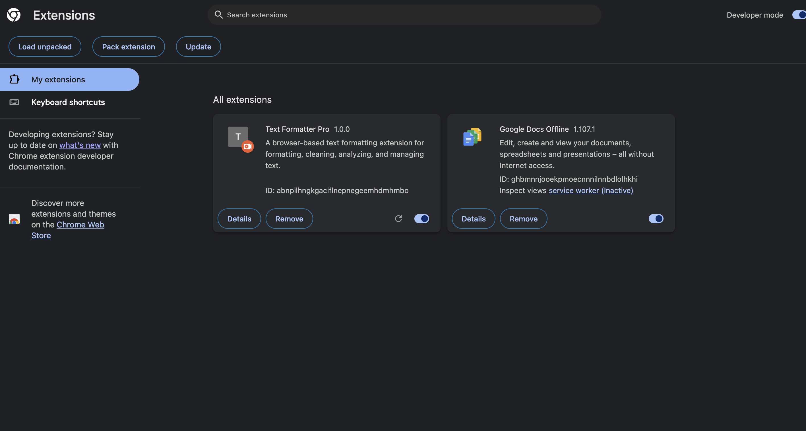

# Text Formatter Pro Installation Guide

## Table of Contents

- [Overview](#overview)
- [Prerequisites](#prerequisites)
- [Installation](#installation)
- [Verification](#verification)
- [Troubleshooting](#troubleshooting)

## Overview

Text Formatter Pro is a React-based Chrome Extension that provides text formatting and cleanup utilities directly inside the browser.

This document explains the prerequisites, installation process, verification steps, and troubleshooting for setting up the extension locally.

## Prerequisites

Before installing Text Formatter Pro, ensure the following are available:

- Git
- Google Chrome or a Chromium-based browser
- Node.js
- npm package manager

Verify the installations using:

```bash
git --version
node --version
npm --version
```

## Installation

Text Formatter Pro can be installed locally as a Chrome Extension using the production build.

### Install from VSIX Package

1. Clone the project repository:
```bash
git clone <repository-url>
```

2.Navigate to the project directory:
```bash
cd text-formatter-pro
```

Install the project dependencies:
```bash
npm install
```

Create the production build:
```bash
npm run build
```

The production-ready `dist` folder is generated.
3. Open Google Chrome and navigate to:
 ```bash
chrome://extensions/
```
4.Enable Developer Mode.

5.Click Load unpacked.

6.Select the generated `dist` folder.

7. Confirm that **Text Formatter Pro** appears in the Chrome Extensions list.

8. The extension is now installed and ready to use.

## Verification

1. Open **Text Formatter Pro** from the Chrome Extensions toolbar.
2. Verify that the extension popup opens correctly.
3. Check that the text editor is displayed.
4. Verify that the formatting buttons work.
5. Check that the menu options are accessible.
6. Verify that text statistics update correctly.



## Troubleshooting

If the extension does not work as expected, check the following:

- Ensure the correct `dist` folder is selected.
- Verify that **Developer Mode** is enabled in Chrome.
- Make sure the project dependencies are installed.
- Rebuild the extension using:

```bash
npm run build
```

Reload Text Formatter Pro from chrome://extensions/.
