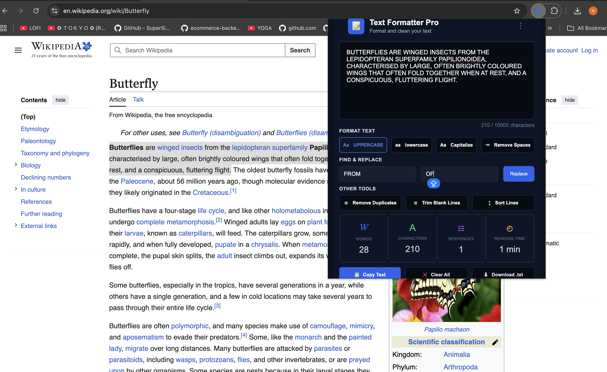
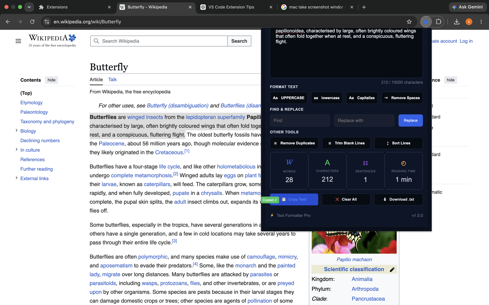

# Text Formatter Pro

Text Formatter Pro is a React-based Chrome Extension designed to simplify everyday text editing workflows by providing fast formatting, cleanup, analysis, and text management tools directly inside the browser.

The extension combines common text utilities such as case conversion, cleanup operations, find and replace, statistics tracking, history management, and local persistence into a lightweight productivity tool.

## Table of Contents

- [Version Information](#version-information)
- [Overview](#overview)
- [Highlights](#highlights)
- [Screenshots](#screenshots)
- [Key Features](#key-features)
- [Technology Stack](#technology-stack)
- [Architecture Overview](#architecture-overview)
- [Data Storage](#data-storage)
- [Target Users](#target-users)
- [Quick Start](#quick-start)
- [Installation](#installation)
- [Usage](#usage)
- [Browser Compatibility](#browser-compatibility)
- [Chrome Extension Permissions](#chrome-extension-permissions)
- [Project Structure](#project-structure)
- [Documentation](#documentation)
- [Known Limitations](#known-limitations)
- [Future Enhancements](#future-enhancements)
- [License](#license)

## Version Information

**Current Version:** 1.0.0  
**Release Status:** Stable Release  
**Platform:** Chrome Extension  
**Manifest Version:** Manifest V3

## Overview

Text Formatter Pro provides a collection of browser-based text utilities designed to improve productivity during writing, documentation, and development workflows.

The extension performs all formatting operations locally and provides additional tools such as history management, clipboard support, file export, and customizable preferences.

The goal of the project is to deliver a fast, privacy-focused, and easy-to-use text processing experience.

## Highlights

- Browser-based text formatting without external tools
- Real-time text statistics and analysis
- Persistent local storage using Chrome Storage API
- Recent text recovery support
- Customizable text limits
- Clipboard integration
- Lightweight React component architecture
- Privacy-focused local data handling
- Local text processing without external servers

## Screenshots

### Text Formatter Pro Interface



### Demo in Chrome 



## Key Features

- Convert text to uppercase
- Convert text to lowercase
- Capitalize words 
- Remove extra spaces
- Remove duplicate lines
- Trim blank lines
- Sort lines alphabetically
- Find and replace text
- Paste text from clipboard
- Copy formatted text
- Download text as a `.txt` file
- Clear editor content

- View text statistics:
  - Word count
  - Character count
  - Line count
  - Reading time

- Recent text history
  - Restore previously used text
  - Delete individual history items
  - Clear all history

- Auto-save functionality
  - Enable or disable auto-save
  - Automatically restore saved text
  - Character limit customization
  - Recent Texts customaization
  - Remembers the text as well

## Technology Stack

| Technology | Purpose |
|---|---|
| React | Component-based user interface |
| JavaScript | Application logic and text processing |
| CSS3 | Responsive extension styling |
| Chrome Extension APIs | Browser integration |
| Chrome Storage API | Local data persistence |
| Manifest V3 | Extension configuration |
| Vite | Development and build tooling |

## Architecture Overview

Text Formatter Pro follows a modular React architecture.

- Components handle independent UI sections
- Context API manages shared application state
- Custom hooks separate reusable logic
- Utility functions handle text transformations
- Chrome Storage API manages persistence

This separation keeps formatting logic, storage handling, and user interface code maintainable.

## Data Storage

Text Formatter Pro stores user preferences and recent text history using Chrome Storage API.

Stored data includes:

- Recent text entries
- Auto-save preferences
- Character limit settings

All data remains stored locally in the browser.

## Target Users

Text Formatter Pro is designed for:

- Developers formatting code-related text
- Technical writers preparing documentation
- Content creators editing text
- Users who frequently clean and transform text data

## Quick Start

Clone the repository:

```bash
git clone https://github.com/ship123456/text-formatter-pro.git
```

Navigate to the project folder:

```bash
cd text-formatter-pro
```

Install dependencies:

```bash
npm install
```

Start development server:

```bash
npm run dev
```

## Installation

1. Build the extension:

```bash
npm run build
```

2. Open Chrome browser.

3. Navigate to:

```
chrome://extensions/
```

4. Enable **Developer Mode**.

5. Click **Load unpacked**.

6. Select the generated build folder.

The extension will now be available in Chrome.

## Usage

1. Open Text Formatter Pro from the browser toolbar.
2. Enter or paste text into the editor.
3. Select a formatting option.
4. Review text statistics.
5. Copy or download the final text.

Additional tools are available from the menu including recent texts, auto-save.

## Browser Compatibility

| Browser | Support |
|---|---|
| Google Chrome | Supported |
| Microsoft Edge | Supported |
| Brave | Supported |

## Chrome Extension Permissions

The extension uses:

### Storage Permission

Used for:

- Saving recent texts
- Auto-save functionality
- Character limit settings

No personal data is collected or sent externally.

## Project Structure

```text
text-formatter-pro/

├── public/
│   ├── icons/
│   └── manifest.json
│
├── src/
│   ├── components/
│   ├── context/
│   ├── hooks/
│   ├── utils/
│   ├── App.jsx
│   ├── App.css
│   ├── main.jsx
│   └── index.css
│
├── docs/
│   ├── screenshots/
│   └── documentation files
│
├── package.json
├── vite.config.js
├── README.md
└── LICENSE
```

## Documentation

Additional documentation is available for setup, usage, architecture, and maintenance:

- [INSTALLATION.md](./INSTALLATION.md)  
  Step-by-step instructions for installing and running the extension.

- [USER_GUIDE.md](./USER_GUIDE.md)  
  Complete guide explaining all text formatting features and user workflows.

- [TECHNICAL_OVERVIEW.md](./TECHNICAL_OVERVIEW.md)  
  Overview of technologies, implementation details, and core functionality.

- [ARCHITECTURE.md](./ARCHITECTURE.md)  
  Application structure, component organization, and data flow.

- [TROUBLESHOOTING.md](./TROUBLESHOOTING.md)  
  Common issues and solutions.

- [RELEASE_NOTES.md](./RELEASE_NOTES.md)  
  Version history, updates, and feature changes.

- [PRIVACY.md](./PRIVACY.md)  
  Details about data storage, permissions, and privacy.

- [LICENSE](./LICENSE)  
  Project license information.

## Known Limitations

- Available as a Chrome-based browser extension
- Text data and preferences are stored locally in the browser
- Requires Chrome Extension APIs for full functionality

## Future Enhancements

- Support for additional export formats
- Advanced formatting options
- Keyboard shortcut support
- Additional browser compatibility testing
- Optional cloud synchronization

## License

This project is licensed under the terms provided in the LICENSE file.
