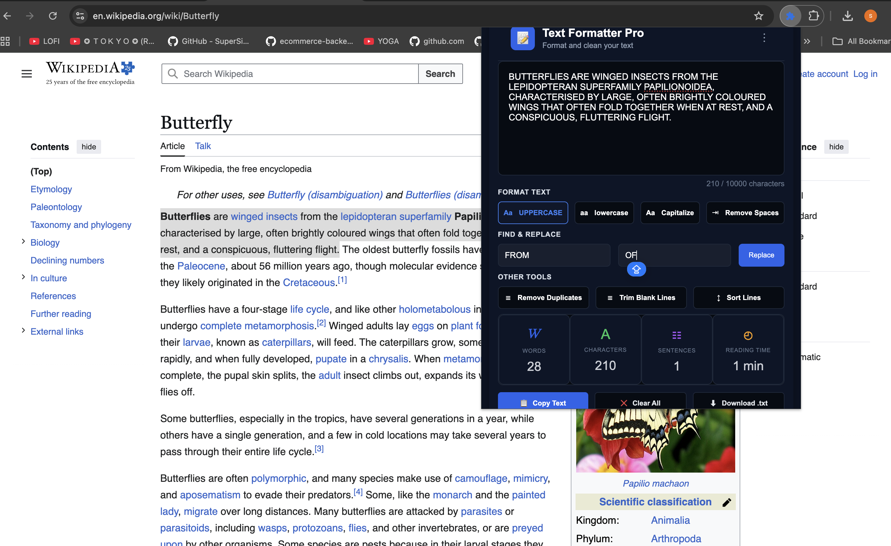
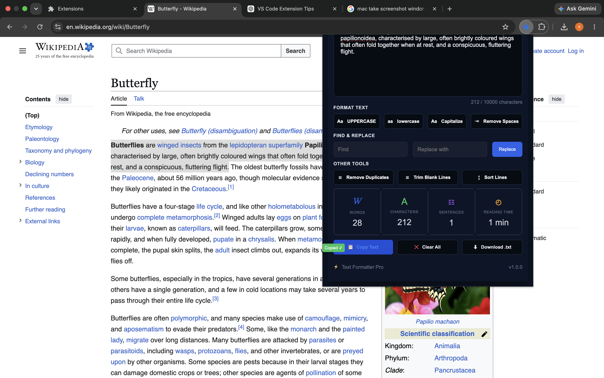

# Text Formatter Pro



### Demo in Chrome



## Table of Contents

- [Overview](#overview)
- [Features](#features)
- [Technology Stack](#technology-stack)
- [Project Structure](#project-structure)
- [Prerequisites](#prerequisites)
- [Installation](#installation)
- [Usage](#usage)
- [Limitations](#limitations)

## Overview

Text Formatter Pro is a React-based Chrome Extension designed to simplify everyday text editing workflows by providing fast formatting, cleanup, analysis, and text management tools directly inside the browser.

The extension combines common text utilities such as case conversion, cleanup operations, find and replace, statistics tracking, history management, and local persistence into a lightweight productivity tool.

The goal of the project is to deliver a fast, privacy-focused, and easy-to-use text processing experience.

## Features

Text Formatter Pro provides the following features:

- Convert text to uppercase
- Convert text to lowercase
- Capitalize words
- Remove extra spaces
- Remove duplicate lines
- Trim blank lines
- Sort lines alphabetically
- Find and replace text
- Paste text from clipboard
- Copy formatted text
- Download text as a `.txt` file
- Clear editor content
- View text statistics such as word count, character count, line count, and reading time
- Manage recent text history
- Restore previously used text
- Delete individual history items
- Clear all history
- Enable or disable auto-save
- Automatically restore saved text
- Customize character limit
- Customize Recent Texts settings

## Technology Stack

| Technology | Purpose |
|---|---|
| React | Component-based user interface |
| JavaScript | Application logic and text processing |
| CSS3 | Responsive extension styling |
| Chrome Extension APIs | Browser integration |
| Chrome Storage API | Local data persistence |
| Manifest V3 | Extension configuration |
| Vite | Development and build tooling |

## Project Structure

```text
text-formatter-pro/

├── public/
│   ├── icons/
│   └── manifest.json
│
├── src/
│   ├── components/
│   ├── context/
│   ├── hooks/
│   ├── utils/
│   ├── App.jsx
│   ├── App.css
│   ├── main.jsx
│   └── index.css
│
├── docs/
│   ├── screenshots/
│   └── documentation files
│
├── package.json
├── vite.config.js
├── README.md
└── LICENSE
```

## Prerequisites

Before using Text Formatter Pro, ensure you have:

- Google Chrome or a Chromium-based browser
- Node.js installed
- npm package manager
- Git version control

## Installation

1. Build the extension:

```bash
npm run build
```
2. Open Google Chrome
3. Navigate to:

```bash
chrome://extensions/
```
4. Enable Developer Mode
5. Click Load unpacked
6. Select the generated dist folder

## Usage

1. Open **Text Formatter Pro** from the browser toolbar.
2. Enter or paste text into the editor.
3. Select a formatting option.
4. Review the text statistics.
5. Copy or download the formatted text.

Additional tools are available from the menu, including **Recent Texts** and **Auto Save**.

## Limitations

- Currently supports Chromium-based browsers only.
- Requires browser permissions for storage and clipboard features.
- Works only as a browser extension (no standalone desktop/mobile version).
- Offline processing only; no cloud synchronization.


