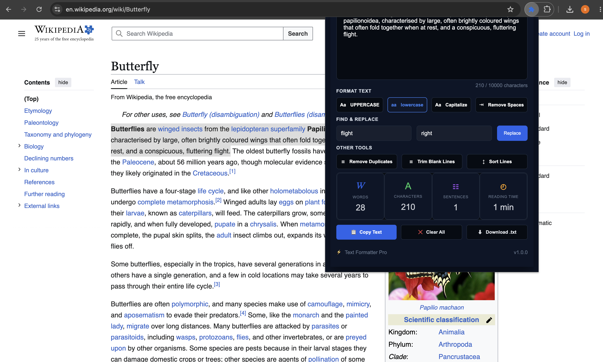
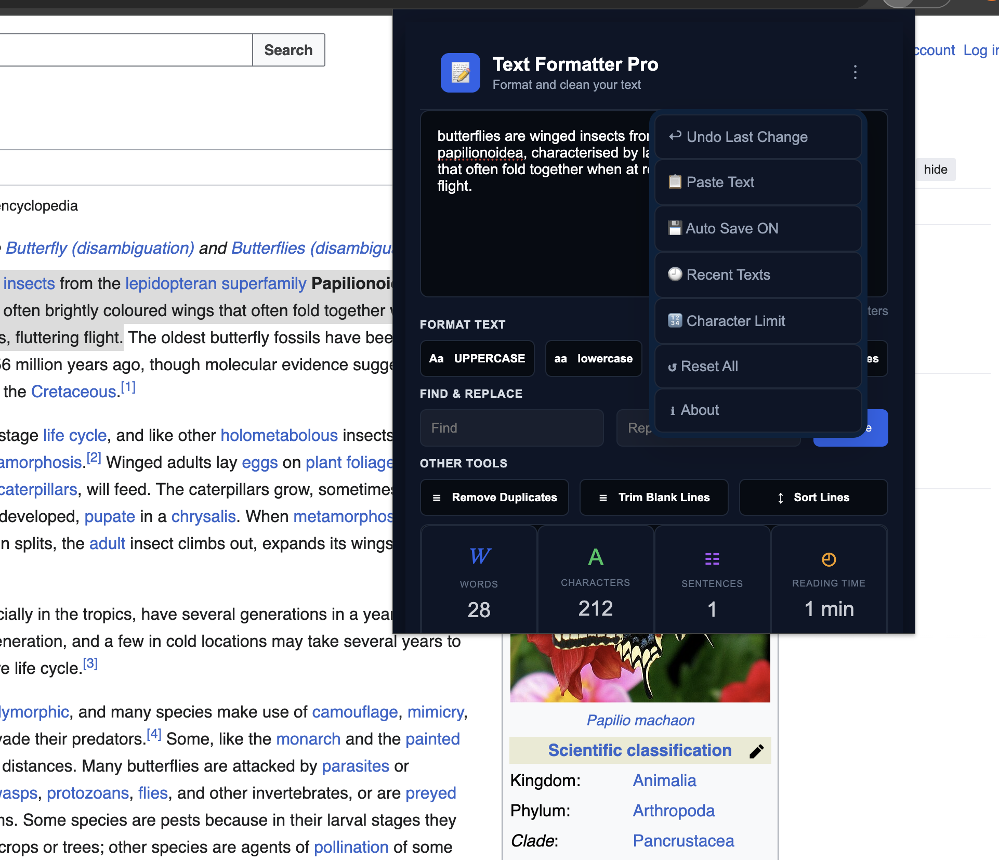
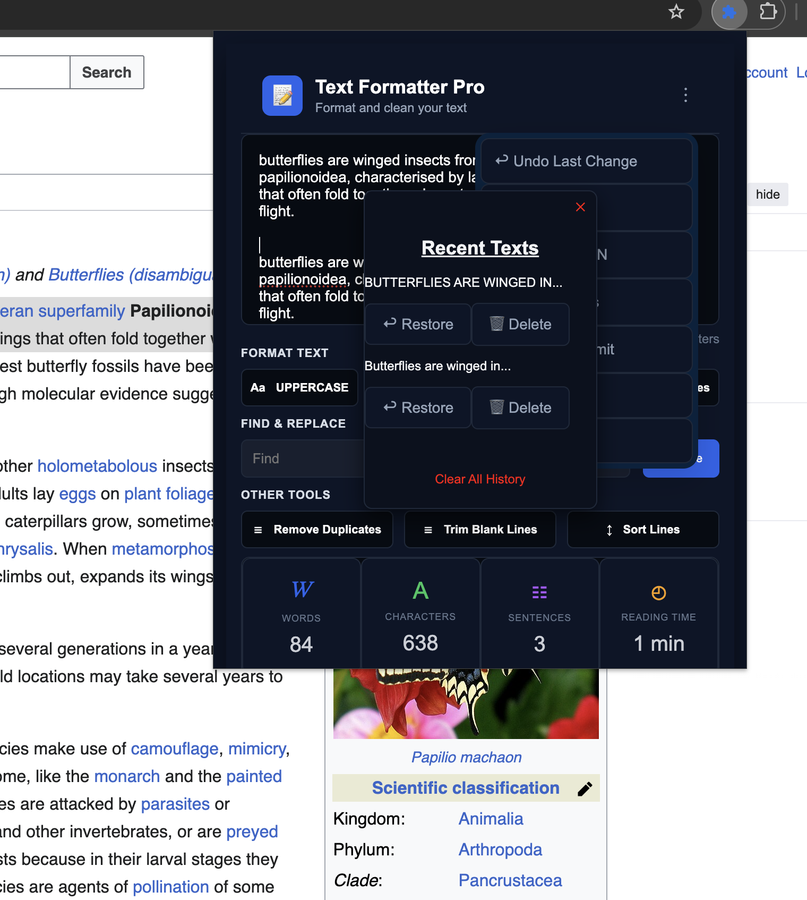
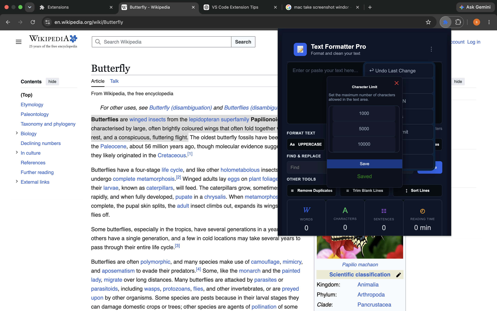
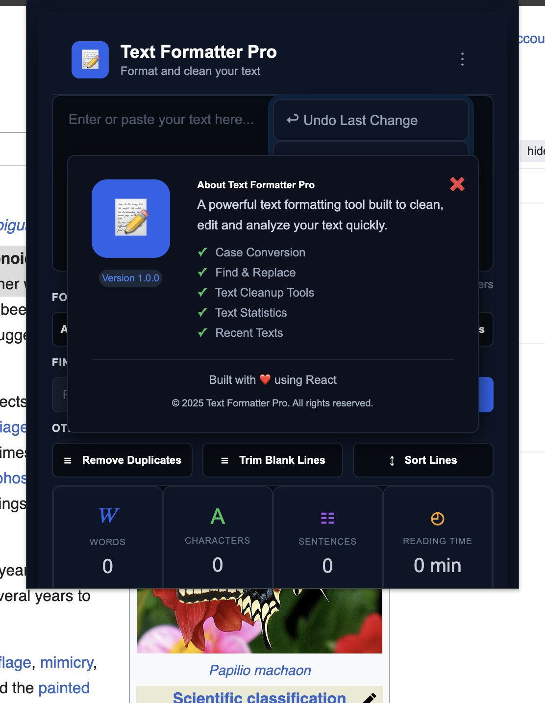

# Text Formatter Pro User Guide

This user guide explains how to use Text Formatter Pro features, including text formatting, cleanup tools, history management, preferences, and productivity options.

## Table of Contents

- [Version Information](#version-information)
- [System Requirements](#system-requirements)
- [Overview & Interface Introduction](#overview--interface-introduction)
- [Interface Components](#interface-components)
- [Main Text Workspace](#main-text-workspace)
- [Text Formatting Tools](#text-formatting-tools)
- [Text Cleaning Utilities](#text-cleaning-utilities)
- [Find & Replace](#find--replace)
- [Copy and Download Options](#copy-and-download-options)
- [Real-Time Text Statistics](#real-time-text-statistics)
- [Three Dots Menu Options](#three-dots-menu-options)
- [Undo Last Change](#undo-last-change)
- [Auto Save Feature](#auto-save-feature)
- [Managing Text History](#managing-text-history)
- [Character Limit Settings](#character-limit-settings)
- [Managing App Preferences](#managing-app-preferences)
- [Resetting Preferences](#resetting-preferences)
- [About Section](#about-section)
- [Common Usage Examples](#common-usage-examples)
- [Error Handling](#error-handling)
- [Tips & Best Practices](#tips--best-practices)
- [Data Privacy](#data-privacy)
- [Browser Behavior](#browser-behavior)
- [Frequently Asked Questions (FAQ)](#frequently-asked-questions-faq)
- [Need Help](#need-help)
  
## Version Information

**Application:** Text Formatter Pro  
**Version:** 1.0.0  
**Platform:** Chrome Extension  
**Manifest Version:** Manifest V3

## System Requirements

Text Formatter Pro requires:

- Google Chrome or Chromium-based browser
- Local browser storage access

Text Formatter Pro does not require a user account and performs text operations locally inside the browser.

## Overview & Interface Introduction

Text Formatter Pro provides a compact text editing workspace inside the browser.

The interface includes:

- Main text editor
- Formatting controls
- Cleanup utilities
- Find and replace tools
- Text statistics
- History and preference options

All text operations are performed locally inside the browser.

### Main Interface

## Interface Components

| Section | Description |
|---|---|
| Text Editor | Area for entering and editing text |
| Formatting Tools | Provides case conversion options |
| Cleanup Tools | Removes unwanted formatting issues |
| Find & Replace | Searches and updates text values |
| Statistics Panel | Displays live text information |
| Menu Options | Provides access to Undo, Paste, Auto-save, Recent Texts, Character Limit, Reset Preferences, and About. |

## Main Text Workspace

The main workspace allows users to enter and edit text.

Users can:

- Type text manually
- Paste content from clipboard
- Modify existing text
- Apply formatting operations
- Track text information instantly

## Text Formatting Tools

Formatting tools modify the appearance and structure of text.

Available options:

### Uppercase

Converts all text characters into uppercase.

### Lowercase

Converts all text characters into lowercase.

### Capitalize

Capitalizes text by converting the first character of words or sentences into uppercase.

## Text Cleaning Utilities

Cleaning tools remove unwanted formatting issues.

Available utilities:

### Remove Extra Spaces

Removes unnecessary spaces from text.

### Remove Duplicate Lines

Detects repeated lines and keeps unique entries.

### Trim Blank Lines

Removes empty lines from text content.

### Sort Lines

Sorts multiple lines alphabetically.

## Find & Replace

The Find & Replace feature allows users to quickly update text.

Steps:

1. Enter the text value to find.
2. Enter the replacement value.
3. Select Replace.

The matching text will be updated.

## Copy and Download Options

### Copy Text

Copies the current formatted text to the clipboard.

### Download Text

Exports the current text content as a `.txt` file.

### Clear Text

Removes all text from the editor.

## Real-Time Text Statistics

Text Formatter Pro automatically calculates:

- Characters
- Words
- Lines
- Reading time

Statistics update whenever the text changes.

## Three Dots Menu Options

The menu provides additional controls:

- Undo Last Change
- Paste Text
- Auto Save ON/OFF
- Recent Texts
- Character Limit
- Reset Preferences
- About

## Undo Last Change

Restores the previous text state before the latest formatting operation.

## Auto Save Feature

Auto Save stores text automatically using Chrome Storage.

Users can:

- Turn Auto Save ON
- Turn Auto Save OFF

When enabled, the current text is restored automatically. Auto-save preferences, recent text history, and the character limit are also preserved. 

## Managing Text History

Recent Texts allows users to access and manage previously entered text.

Users can:

- Restore saved text
- Delete individual history items
- Clear complete history

## Character Limit Settings

Users can customize the maximum text length allowed inside the editor.

This helps control the amount of text processed inside the extension.

## Resetting Preferences

Reset Preferences restores the default application settings using the Reset All option.

This action restores user settings back to their default values.

## About Section

The About section displays:

- Application information
- Current version
- Available features
- Technology details

## Common Usage Examples

Examples:

- Cleaning copied text from documents
- Preparing formatted content
- Removing duplicate lists
- Editing notes quickly
- Checking text length before publishing

## Error Handling

Text Formatter Pro provides simple feedback messages for user actions.

Examples:

- Confirmation after copying text
- Confirmation after downloading text
- Handling empty text input when formatting actions are performed.

These messages help users understand the result of their actions.

## Tips & Best Practices

- Enable Auto Save for ongoing work
- Clear history regularly if no longer needed
- Use Find & Replace for repeated edits
- Review statistics before exporting text

## Data Privacy

Text Formatter Pro processes all text directly inside the browser.

The extension does not:

- Upload text to external servers
- Share user content
- Require user accounts
- Track user text activity

User preferences and recent history are stored locally using Chrome Storage.

> Note:
> Very large text inputs may affect browser performance.

## Browser Behavior

Text Formatter Pro runs as a browser extension popup.

Closing the popup does not remove saved preferences when Auto Save is enabled.

Users can reopen the extension anytime from the browser toolbar.

## Frequently Asked Questions (FAQ)

### Is my text stored online?

No. Text data remains stored locally.

### Does the extension need internet?

No. Text processing works locally.

### Can I recover previous text?

Yes. Use the Recent Texts feature.

### Can I export my text?

Yes. Use the Download option to save text as a `.txt` file.

### Can I remove saved history?

Yes. Open Recent Texts and select Clear All History.

### Can I change the maximum text size?

Yes. Use Character Limit settings from the menu.

## Need Help?

For common problems and solutions, see:

[TROUBLESHOOTING.md](./TROUBLESHOOTING.md)
