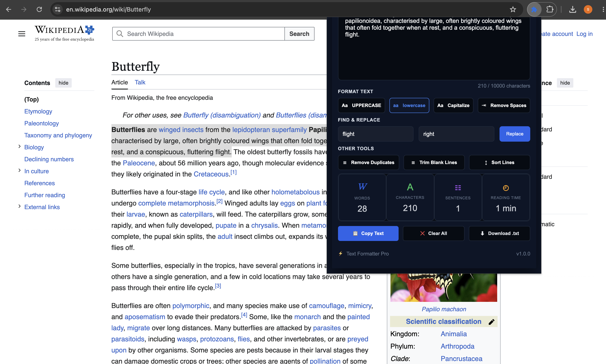

# Text Formatter Pro User Guide

## Table of Contents

- [Overview](#overview)
- [Getting Started](#getting-started)
- [How to Use](#how-to-use)
- [Features](#features)
- [Common Tasks](#common-tasks)
- [Troubleshooting](#troubleshooting)
- [FAQ](#faq)

## Overview

Text Formatter Pro is a React-based Chrome Extension designed to simplify everyday text editing workflows by providing fast formatting, cleanup, analysis, and text management tools directly inside the browser.

The extension combines common text utilities such as case conversion, cleanup operations, find and replace, statistics tracking, history management, and local persistence into a lightweight productivity tool.

## Getting Started

Text Formatter Pro requires:

- Google Chrome or Chromium-based browser
- Local browser storage access

Text Formatter Pro does not require a user account and performs text operations locally inside the browser.

### Main Interface

## How to Use

1. Open Text Formatter Pro from the browser toolbar.
2. Enter or paste text into the editor.
3. Select a formatting or cleanup option.
4. Review the updated text and statistics.
5. Use **Copy** to copy the formatted text.
6. Use **Download** to save the text as a `.txt` file.

## Features

- Convert text to uppercase
- Convert text to lowercase
- Capitalize words
- Remove extra spaces
- Remove duplicate lines
- Trim blank lines
- Sort lines alphabetically
- Find and replace text
- Copy formatted text
- Paste text from clipboard
- Download text as a `.txt` file
- View real-time text statistics
- Manage recent text history
- Enable or disable Auto Save
- Customize character limits
- Reset application preferences

## Common Tasks

### Clean Text

Use the cleanup tools to:

- Remove extra spaces
- Remove duplicate lines
- Trim blank lines
- Sort lines alphabetically

### Find and Replace Text

1. Enter the text to find.
2. Enter the replacement text.
3. Select **Replace**.

### Copy or Download Text

- Select **Copy** to copy the current text.
- Select **Download** to export the text as a `.txt` file.

### Manage Recent Texts

Open **Recent Texts** to:

- Restore saved text
- Delete individual history items
- Clear complete history

### Use Auto Save

Open the menu and enable **Auto Save** to automatically save and restore the current text.

### Change Character Limit

Open **Character Limit** from the menu to customize the maximum text length allowed in the editor.

### Reset Preferences

Open **Reset Preferences** and select **Reset All** to restore the default application settings.

## Troubleshooting

For common problems and solutions, see the troubleshooting guide:

[TROUBLESHOOTING.md](./TROUBLESHOOTING.md)
